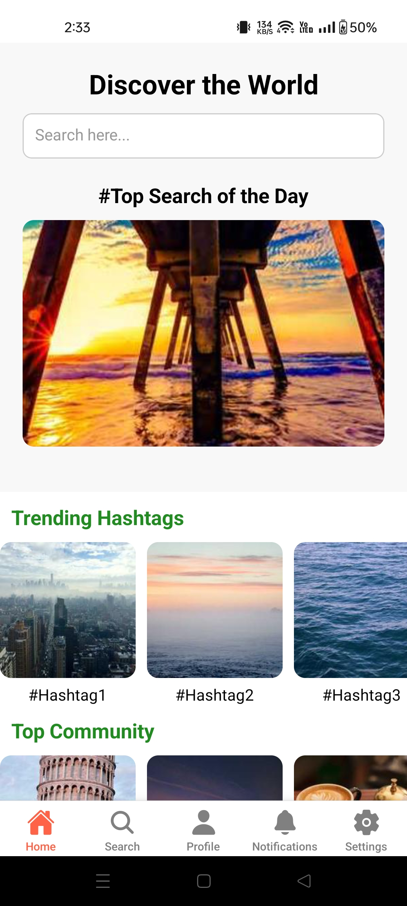
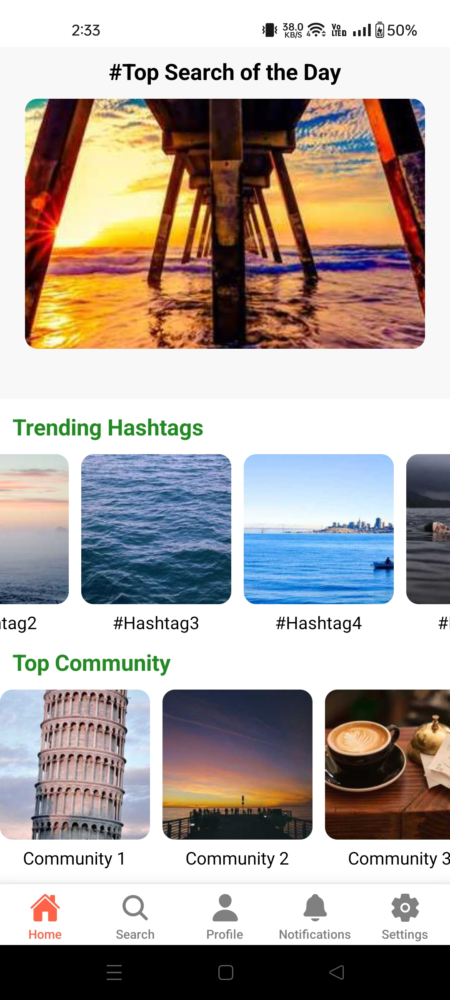
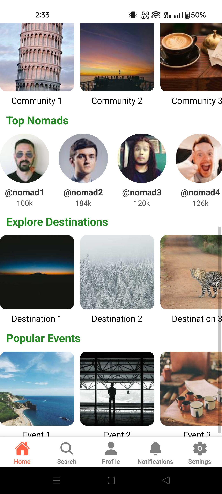
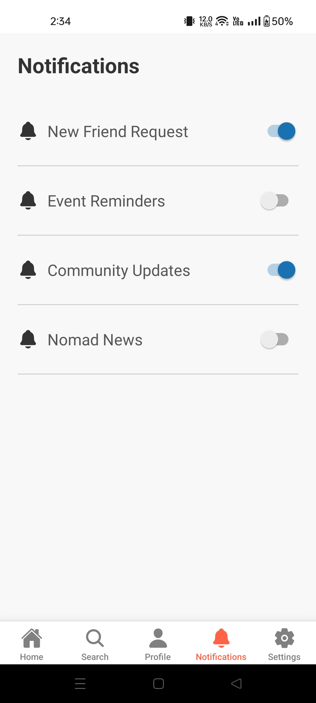
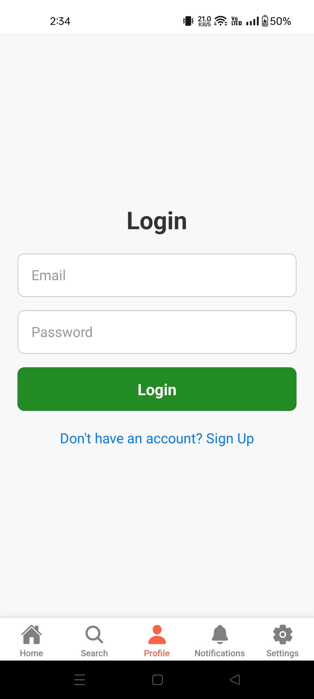
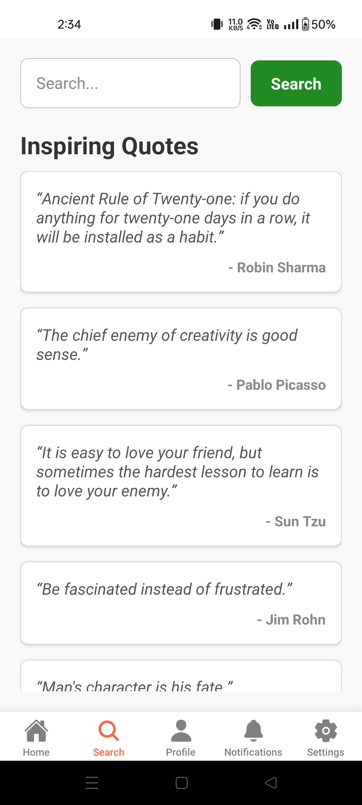
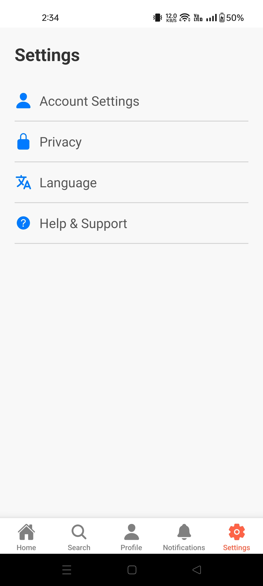

# Search Screen Application

This React Native application features a search screen that dynamically displays inspiring quotes, a search functionality, and a clean user interface. Below, you'll find a detailed description of the application's functionality, its features, and screenshots of the UI.

## Features

1. **Search Bar**:
   - Allows users to input text and trigger a search action.
   - Placeholder text: `Search...`.

2. **Inspiring Quotes Section**:
   - Dynamically fetches quotes from the ZenQuotes API (`https://zenquotes.io/api/quotes`).
   - Displays each quote with its content and author in a clean, styled layout.

3. **Loading Indicator**:
   - Displays a spinner while the quotes are being fetched.

4. **Error Handling**:
   - Alerts users in case of a failure to fetch quotes.

5. **Responsive UI**:
   - Ensures the layout looks great on various screen sizes and orientations.

6. **FlatList**:
   - Scrollable list of dynamically fetched quotes.

## Screenshots

Below are the screenshots demonstrating the features of the application. All screenshots are located in the `Resource` folder in the root directory on GitHub.

### 1. Home Bar


### 2. Loading Indicator


### 3. Quotes List


### 4. Quote Card


### 5. Error Handling


### 6. Responsive UI - Portrait Mode


### 7. Responsive UI - Landscape Mode


## API Integration

### ZenQuotes API

The application integrates the [ZenQuotes API](https://zenquotes.io/) to fetch inspirational quotes. The API provides random quotes with the following fields:

- **`q`**: Quote content.
- **`a`**: Author of the quote.

### API Endpoint
```
https://zenquotes.io/api/quotes
```

### Example Response
```json
[
  {
    "q": "The best way to predict the future is to create it.",
    "a": "Peter Drucker"
  },
  {
    "q": "Success is not the key to happiness. Happiness is the key to success.",
    "a": "Albert Schweitzer"
  }
]
```

## Installation and Setup

1. Clone the repository:
   ```bash
   git clone <repository_url>
   ```

2. Navigate to the project directory:
   ```bash
   cd <project_directory>
   ```

3. Install dependencies:
   ```bash
   npm install
   ```

4. Start the application:
   ```bash
   npm start
   ```

5. Use an emulator or a physical device to run the app.

## Technologies Used

- **React Native**
- **ZenQuotes API**
- **FlatList**
- **ActivityIndicator**
- **TouchableOpacity**
- **TextInput**

## How to Use

1. **Search**: Enter text in the search bar and tap `Search` to trigger the action.
2. **Quotes List**: Scroll through the dynamically fetched quotes.
3. **Error Handling**: If the quotes fail to load, an error alert will notify you.
4. **Responsive Design**: Use the app in both portrait and landscape modes for a seamless experience.

## Contribution

Contributions are welcome! Feel free to open issues or submit pull requests to improve the app.

## License

This project is licensed under the MIT License. See the LICENSE file for details.

